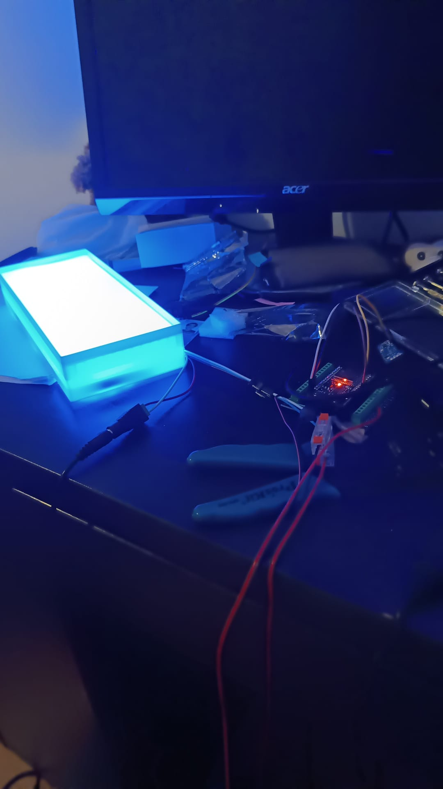
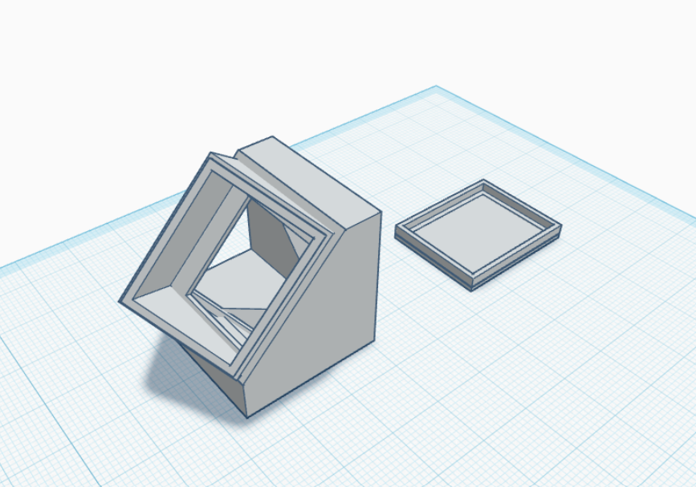

# Kuiet Cube

A collaborative project between **NOVA SBE** and **KPMG** to design and build a dedicated space for **meditation and deep focus** on campus.

The Kuiet Cube is a quiet room where an **external status LED** responds to presence — helping people step out of distraction and into a calmer, more focused state. This repository contains the embedded firmware, 3D-printable hardware, and project media for the presence-sensing system used in the cube.

## Demo

<table>
  <tr>
    <td align="center">
      <br>
      <sub>Desk installation</sub>
    </td>
    <td align="center">
      <a href="https://youtube.com/shorts/G4Zh3A4YDuU">
        
      </a><br>
      <sub><a href="https://youtube.com/shorts/G4Zh3A4YDuU">Room demo</a></sub>
    </td>
    <td align="center">
      <br>
      <sub>Sensor enclosure (3D)</sub>
    </td>
  </tr>
</table>

## Overview

The room uses **contactless presence detection** instead of switches or motion buttons. When someone enters the cube, the **external LED** (mounted outside) turns on as a visual indicator; when the space is empty, it turns off.

| Component | Role |
|-----------|------|
| **ESP32** | Main controller |
| **HLK-LD2410** | 24 GHz mmWave radar for presence detection |
| **WS2811 LED strip** | External status LED (13 LEDs) |
| **3D-printed parts** | Sensor enclosure + external LED housing |

## Project structure

```
├── src/                    # Firmware (PlatformIO / Arduino)
├── scripts/                # Serial plotting & development tools
├── hardware/stl/           # 3D-printable parts (sensor enclosure + external LED)
└── docs/media/photos/      # Installation and hardware photos
```

## Hardware — 3D models

Print files are in [`hardware/stl/`](hardware/stl/) — used for both the desk-mounted radar enclosure and the **external LED housing**:

| File | Description |
|------|-------------|
| `esp32-box-top.stl` | Top half of the ESP32 / sensor enclosure |
| `esp32-boxbottom.stl` | Bottom half of the ESP32 / sensor enclosure |
| `suporte.stl` | Mount / bracket |
| `tampa.stl` | Lid / cover (sensor & LED assemblies) |

See the **Demo** section above for a render of the 3D-printed enclosure.

## Firmware

Built with [PlatformIO](https://platformio.org/) for **ESP32**.

### Build environments

| Environment | Source | Purpose |
|-------------|--------|---------|
| `app` | `src/main.cpp` | Production firmware — presence → LED on/off |
| `radar_test` | `src/radar_test.cpp` | Radar diagnostics & serial plotting |
| `led_test` | `src/led_test.cpp` | LED strip verification |

### Quick start

```bash
# Install PlatformIO, then from the repo root:
pio run -e app
pio run -e app -t upload
pio device monitor
```

### Wiring (default)

| Signal | ESP32 pin |
|--------|-----------|
| Radar TX → ESP RX | GPIO 16 |
| Radar RX → ESP TX | GPIO 17 |
| LED data | GPIO 5 |

Radar UART: **256000 baud**. Monitor/debug serial: **115200 baud**.

### Live radar plot (development)

```bash
pip install -r scripts/requirements-plot.txt
pio run -e radar_test -t upload
python scripts/plot_radar_serial.py COM7   # adjust port
```

## Partners

- [NOVA SBE](https://www.novasbe.unl.pt/) — Business school partner & project host
- [KPMG](https://home.kpmg/) — Collaboration on the Kuiet Cube initiative

## License

Unless otherwise noted, project materials are shared for reference and educational use. Contact the maintainers before commercial reuse.
